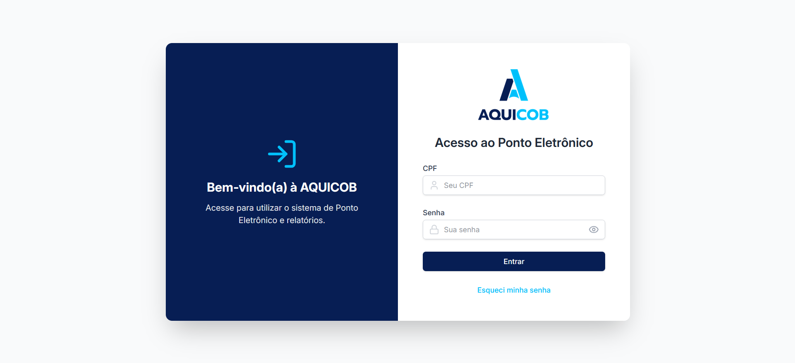

## 📸Imagem do projeto

  

## 🖥️Sobre o projeto
Esse é um projeto Web Responsivo de um Ponto Eletrônico destinado à empresa AQUICOB.

## 🚀Tecnologias utilizadas
Esse projeto foi desenvolvido um processo para vaga de desenvolvedor com as seguintes tecnologias: 
-React.JS 
-TypeScript 
-Tailwind CSS 
-Vite 
-Git e GitHub 